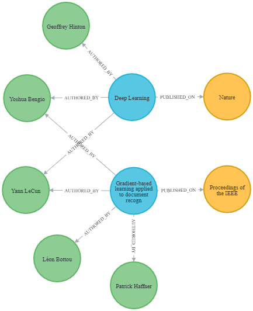
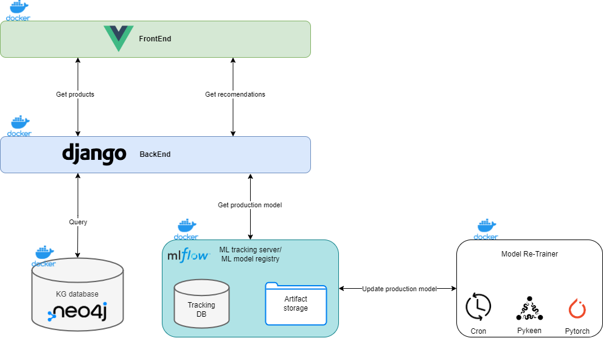

# KG-RecSys
A simple recommendation system powered by knowlege graph embedding models.

## Description
Recomendation systems are the backbone of several online products nowadays, from online stores to streaming services. This algorithms allow for a more guided and plesant user experience by reducing the manual filetring the user has to make.

In this project I intend to explore the use recent Machine Learning models based on knowledge graph data structures, on the context of Recomendation Systems.

### What is a knowledge graph?
Knowledge graphs (KGs) are data structures, that allow to represent multi-relational and multi-class data simply by using nodes (real world entities) and edges (relations between nodes).



### Knowledge graph embeddings

As KGs are a simple structure it easy to translate the information in them into a simple text form, that is a list of triples. A triple is a the most basic form of a truth on a knowledge graph. It is composed of two nodes and a relation between them (head, relation, tail). 

In recent years models were created that allow to use these triples list inputs, and obtain context aware latent vector representations of both nodes and relations of said graphs. These models are called Knowledge Graph Embedding Models (KGE models).

#### Model used in this project

There are several strategies to make this happen. In this project I only focus on one model that uses a translational strategy: TransE. TransE bases itself on the Translation Invariant idea explored by word2vec. This is, that for pairs of nodes that share the same type of relation between them, their position between them on the latent space should be similar. A popular example is the King Queen setting, in which the vector between the kning and man, should be the same between queen and wooman on a "perfect" embedding space. Baed on this idea TransE optimizes for this objective.

### Project setting

As this project is to serve as a proof of work, I developed a "demo" online store. The theme beeing a store that sells Magic the Gathering trading cards (a game that I play since i was a kid). The use of trading cards as a theme is easily replaced by other products, however this theme allowed me to get a better understanding of the recomendation system performance, this is because the recomendations are easy to verify. A good recomendation is one that presents cards that have similar/game mechanics themes to the ones that the user already bought and/or similar to what other users that bought similar cards have.

### Architecture



## How to run

First you need to create a *neo-compose2/data* folder in your HOME directory, given that docker volumes are created for root user, which then creates problems for neo4j.

Then you only need to run:

```console
foo@bar:repo$ docker-compose build
foo@bar:repo$ docker-compose up
```

(Attention, depending on if you have or not a GPU, parts of the docker compose have to be commented, this will to be more automatic in the future)

## Future improvements
- Automate project build;
- Generalize django classes in order to allow for any online store to be linked;
- Improve re-training system to preform hyperparameter optimization in case performance drops;
- Allow to switch users on fronend;
